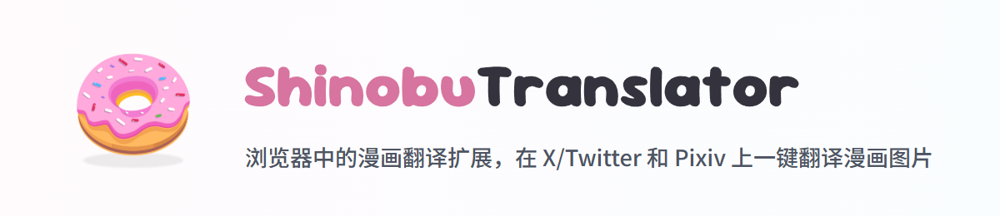
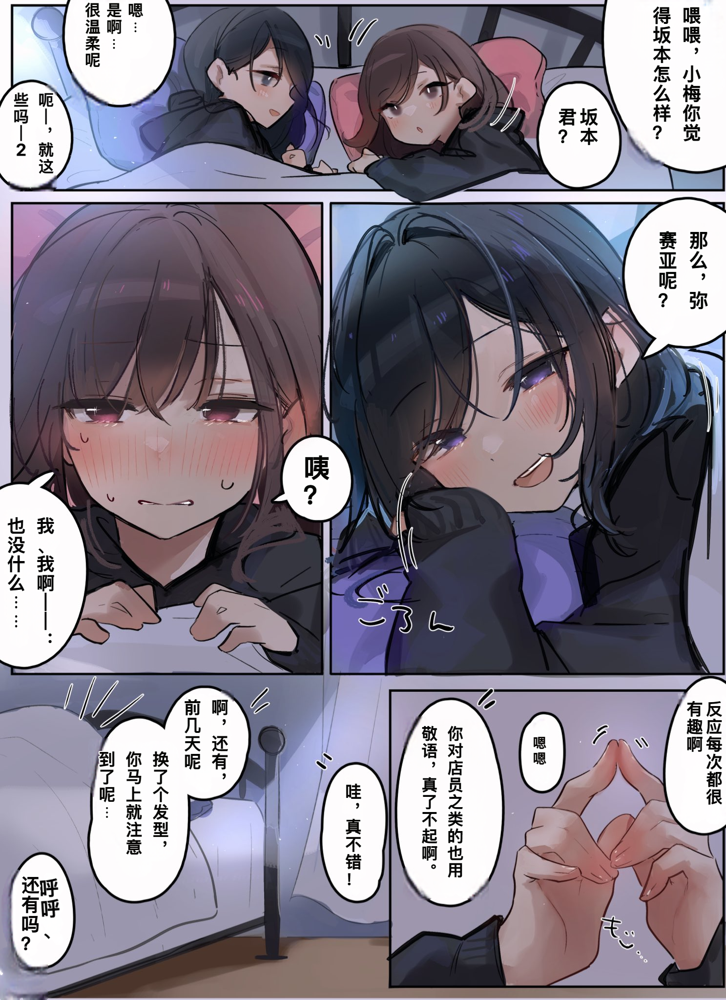
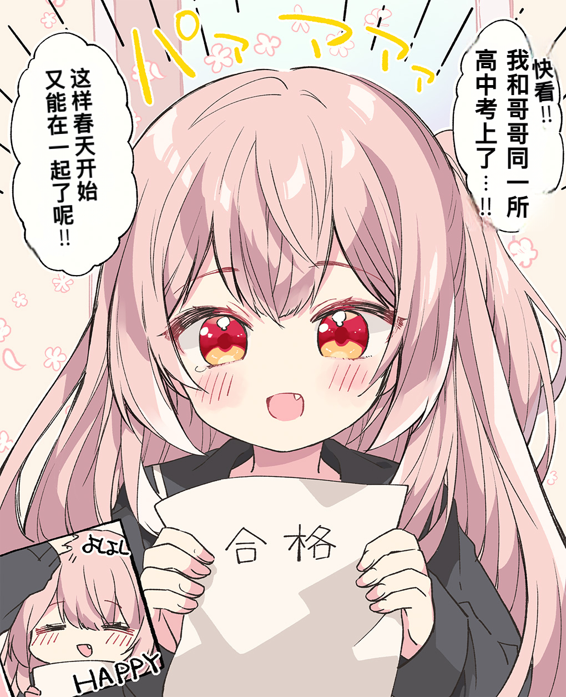
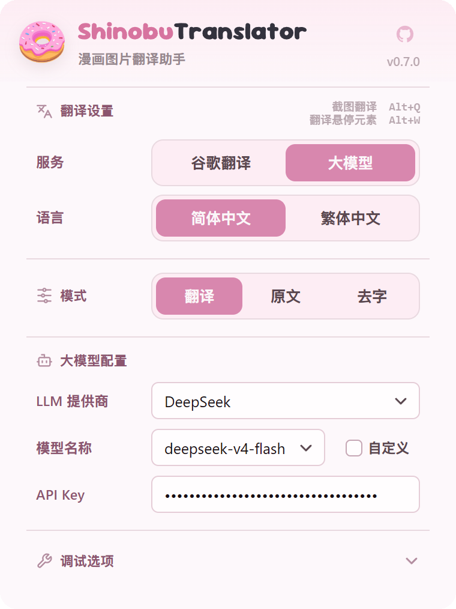
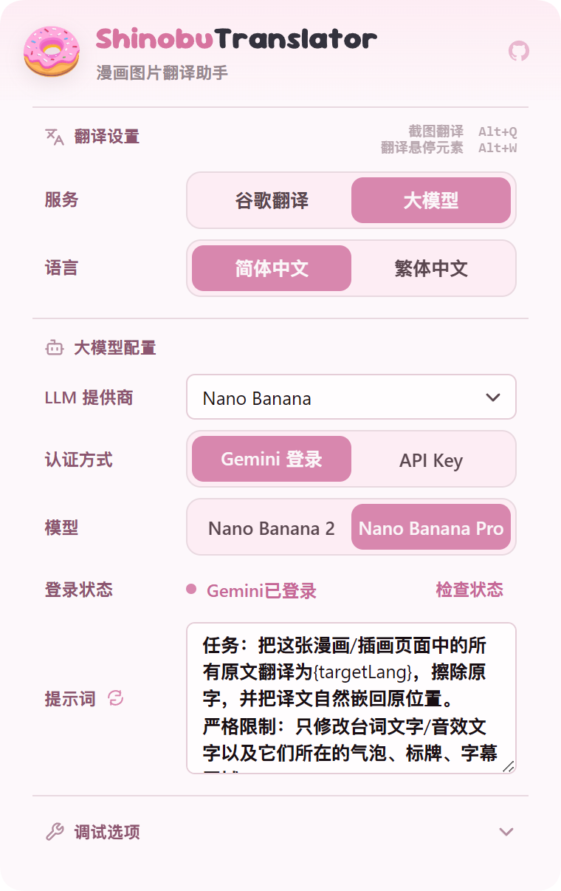

<p align="center">
  
</p>

<h1 align="center">ShinobuTranslator</h1>

<p align="center">
  在浏览器里直接翻译漫画图片的 Chromium / Firefox 扩展与网页版。
</p>

<p align="center">
  <a href="https://chromewebstore.google.com/detail/pgehhpbnifjlalmmnpiebkjhphojffef"></a>
  <a href="LICENSE"></a>
  <a href="https://github.com/zyddnys/manga-image-translator"></a>
  <a href="https://huggingface.co/PaddlePaddle/PP-OCRv6_medium_rec_onnx"></a>
  <a href="https://huggingface.co/mayocream/aot-inpainting"></a>
  <a href="https://huggingface.co/huyvux3005/manga109-segmentation-bubble"></a>
</p>

一款漫画翻译扩展程序，识别/去字等模型仅在浏览器本地运行，无需单独服务器。主要支持日文漫画场景，自动进行识别、翻译、嵌字全流程。同时提供基于Nano Banana的翻译模式，可以利用Gemini订阅对各种类型漫画进行端到端翻译。对于 X / Pixiv / eHentai 做了专门适配，其他网站均可使用右键/键盘快捷键进行截图翻译。

## 快速开始

### Chrome Web Store

> 项目版本更新较快，Chrome Web Store 需等待审核，可能落后于最新版本。如需体验最新功能，建议使用下方的手动安装。

[](https://chromewebstore.google.com/detail/pgehhpbnifjlalmmnpiebkjhphojffef)

### 手动安装

1. 前往 [Releases](../../releases) 下载当前版本对应浏览器的压缩包：Chromium 使用 `ShinobuTranslator-chromium-v*.zip`，Firefox 使用 `ShinobuTranslator-firefox-v*.zip`
2. 解压到本地文件夹
3. Chrome / Edge：打开扩展管理页，启用「开发者模式」，选择「加载已解压的扩展程序」
4. Firefox Desktop 140+：打开 `about:debugging#/runtime/this-firefox`，选择「临时载入附加组件」，再选择解压目录中的 `manifest.json`

## 效果展示

<table>
<thead>
<tr>
<th align="center" width="50%">原始图片</th>
<th align="center" width="50%">翻译后图片</th>
</tr>
</thead>
<tbody>
<tr>
<td align="center" width="50%">
  <a href="https://user-images.githubusercontent.com/31543482/232265329-6a560438-e887-4f7f-b6a1-a61b8648f781.png">
    
  </a>
  <br>
  <a href="https://twitter.com/09ra_19ra/status/1647079591109103617/photo/1">Source @09ra_19ra</a>
</td>
<td align="center" width="50%">
  <a href="assets/readme/translated1.png">
    
  </a>
</td>
</tr>
<tr>
<td align="center" width="50%">
  <a href="https://user-images.githubusercontent.com/31543482/232265794-5ea8a0cb-42fe-4438-80b7-3bf7eaf0ff2c.png">
    
  </a>
  <br>
  <a href="https://twitter.com/rikak/status/1642727617886556160/photo/1">Source @rikak</a>
</td>
<td align="center" width="50%">
  <a href="assets/readme/translated4.png">
    
  </a>
</td>
</tr>
</tbody>
</table>

## 工作流程

### 本地 OCR 翻译流程

```text
图片获取 -> 文本检测 -> 气泡检测 -> OCR 识别 -> 文本翻译 -> 蒙版细化 -> 去字修复 -> 自动排版 -> 译图展示
```

本地流程适合常规漫画翻译：视觉模型在浏览器端完成检测、识别、去字和排版，只把识别出的文本交给谷歌翻译或大模型翻译。

### Nano Banana 图像翻译流程

```text
图片获取 -> 发送图片与提示词 -> 多模态理解和翻译 -> 去字重绘和嵌字 -> 译图展示
```

Nano Banana 流程不走本地 OCR、去字和自动排版链路，而是把图片交给 Nano Banana 进行端到端图像翻译。对于有拟声词和手写字体的漫画翻译效果更佳，而且可以支持英文、韩文等各种语言，但是会对漫画内容本身有一定的影响。

## 功能特性

| 模块 | 说明 |
| --- | --- |
| 文本检测 | 自动识别漫画图中的文字区域（含**小字增强**，见下） |
| 气泡检测 | 辅助定位对白区域，让去字和嵌字更自然 |
| OCR 识别 | 使用浏览器端 ONNX 模型识别日文漫画文字 |
| 翻译 | 支持谷歌翻译、DeepSeek、通义千问（Qwen）、GLM、Kimi、MiniMax、MiMo、OpenAI、自定义供应商 |
| Nano Banana | 支持使用 Gemini 订阅的 Nano Banana 图像翻译流程，用于端到端翻译和嵌字 |
| 去字修复 | 使用本地去字模型擦除原文 |
| 自动排版 | 根据文字区域、方向、颜色和气泡空间自动嵌入译文 |
| 原图切换 | 支持原图和译图切换查看 |
| 截图翻译 | 通过快捷键或右键菜单选择页面区域翻译 |

### 小字增强（文本检测）

文本检测模型的输入尺寸**写死为 1024×1024**，而它拿到的是 letterbox 到该尺寸的整图。
一张 5100×3300 的规格图纸因此被缩到 **0.2 倍**，14px 的小字只剩 2.8px —— 整张图只检出 9 个区域，
标注、型号、尺寸这类小字基本全丢。

小字增强把图按**原生分辨率**切成 1024 的块分别检测，再把结果映射回整图，并做三层过滤
（连通块尺寸/实心度/墨量 → 按字高相近连成行 → 行墨量与"至少两个字形"），
最后只把检测器没覆盖到的区域补进去，掩膜是**笔画级**的（不是把框涂满）。

同一张图纸的实测（`tests/pipeline/smallTextDetect.test.ts` 覆盖过滤规则）：

| | 检出区域 | OCR 认出 | 行高分布 |
| --- | --- | --- | --- |
| 关闭增强 | 7 | 9 行 | 最小 35px |
| 开启增强（默认） | 65 | 77 行（多字符 70） | **9px 起**，中位 23px |

代价：纯 JS 约 0.4 秒，OCR 多花约 1.5 秒；ONNX 检测推理次数不变。
不需要时可以在调用处传 `smallTextEnhance: false` 关掉（`runPipeline` 的 run options）。

## 设置界面

<table>
<tr>
<td align="center" width="50%">
  
  <br>
  文本翻译设置
</td>
<td align="center" width="50%">
  
  <br>
  Nano Banana 图像翻译设置
</td>
</tr>
</table>

## 使用方式

### 已适配站点

在 X 、Pixiv、E-Hentai 的已适配页面中，在大图页面会直接显示翻译按钮。

Pixiv 漫画阅读模式额外提供底部按钮，可翻译当前页或全部页面。

### 通用网页翻译

在其他网页中，可以使用以下方式翻译漫画图片：

| 操作 | 默认快捷键 | 说明 |
| --- | --- | --- |
| 右键翻译图片 | - | 对右键位置的图片发起翻译 |
| 截图翻译 | `Alt+Q` | 手动框选页面区域并翻译 |
| 翻译悬停元素 | `Alt+W` | 翻译鼠标当前悬停的图片或区域 |

快捷键可在浏览器的扩展快捷键页面中调整。

## 翻译配置

扩展弹出页提供以下常用配置：

| 配置 | 说明 |
| --- | --- |
| 翻译服务 | 谷歌翻译或大模型翻译 |
| 大模型提供商 | DeepSeek、Nano Banana、GLM、Kimi、MiniMax、MiMo、OpenAI、自定义提供商 |
| 模型 | 可使用内置模型列表，也可填写自定义模型名 |
| 目标语言 | 简体中文或繁体中文 |
| 处理模式 | 翻译、仅去字、排版原文 |
| 调试选项 | 阶段耗时、排版调试、去字调试、日志下载 |

使用大模型翻译时，需要填写对应提供商的 API Key。API Key 由用户在扩展设置中输入，项目仓库不包含任何密钥。

## 本地模型与运行时

ShinobuTranslator 使用 `onnxruntime-web` 在浏览器端运行视觉模型。运行时会按环境尝试 WebGPU、WebNN 或 WASM，实际速度取决于浏览器版本、硬件和系统支持情况。

当前模型资源包括：

| 模型 | 用途 |
| --- | --- |
| `detector` | 文本检测（`detector.ort`） |
| `bubble` | YOLO11n 气泡实例分割（`bubble.onnx`） |
| `paddleocr_v6_medium_rec` | PP-OCRv6 medium OCR 识别（`PP-OCRv6_medium_rec.onnx` + `paddleocr_v6_dict.txt`） |
| `inpaint` | AOT 去字修复（`aot_inpaint_512.onnx`） |

## 从源码运行

需要 Node.js、npm，以及 Chrome / Edge 109+ 或 Firefox Desktop 140+。先安装依赖：

```bash
npm install
```

### 扩展

```bash
npm run dev:extension          # Chromium
npm run dev:extension:firefox  # Firefox
npm run build:extension        # 构建并校验两个目标
```

### 网页版

```bash
npm run dev:web
npm run build:web
```

### 检查与模型

```bash
npm run check            # 完整质量门控
npm run models:download  # 下载缺少的 ONNX 模型
```

## 项目结构

```text
apps/
  extension/        Chromium/Firefox 扩展、入口、专属实现与构建配置
  web/              网页版、历史、PWA 与项目包
  model-gateway/    Cloudflare Workers 私有 R2 模型网关
packages/
  translator-core/  扩展与网页版共用的任务核心
  browser-runtime/  Worker 宿主与浏览器运行时 Adapter
  diagnostics/      扩展与网页版共用的诊断与性能记录
  image-pipeline/   检测、OCR、翻译、去字与排版流水线
  model-runtime/    模型加载、推理后端与共享 ONNX Worker
  shared-config/    网页版配置 Schema、默认值与迁移
  text-translation/ 文本翻译供应商与传输协议
  model-manifest/   网页版与网关共用的内容哈希模型清单
public/
  models/           浏览器端 ONNX 模型资源
  icons/            扩展与网页版图标
assets/
  readme/           README 展示图、设置截图与演示视频
docs/
  agents/           Agent 协作所需的领域、Issue 与分诊约定
benchmark/
  perf/             性能与浏览器端 smoke 测试
  typeset/          排版基准测试
```

## 隐私与安全

- 项目不包含任何内置 API Key 或密钥
- 用户填写的 API Key 保存在浏览器扩展存储中
- 本地视觉流水线在浏览器端运行，不依赖个人服务器
- 使用 Google Web、LLM 或 Nano Banana 时，请自行确认对应服务的隐私政策、费用和使用条款
- 扩展权限以 `apps/extension/manifest.ts` 生成的目标 manifest 为准
- 网页版隐私边界、Cloudflare 元数据和本地存储规则见 [PRIVACY_POLICY.md](PRIVACY_POLICY.md)

## 致谢

本项目的灵感与部分模型处理思路来自：

- [zyddnys/manga-image-translator](https://github.com/zyddnys/manga-image-translator)
- [manga-image-translator 相关油猴脚本](https://greasyfork.org/scripts/437569)
- [PaddleOCR](https://github.com/PaddlePaddle/PaddleOCR)
- [ONNX Runtime Web](https://onnxruntime.ai/)

第三方模型、脚本和许可证说明见 [THIRD_PARTY_NOTICES.md](THIRD_PARTY_NOTICES.md)。
npm 生产依赖精确版本与许可证快照见
[THIRD_PARTY_DEPENDENCIES.json](THIRD_PARTY_DEPENDENCIES.json)。

## 许可证

本项目基于 [GPL-3.0](LICENSE) 许可证开源。

## 免责声明

ShinobuTranslator 仅用于个人学习、研究和合法授权内容的辅助翻译。使用者应自行确认对输入图片、翻译结果和后续传播行为拥有合法权利，并遵守所在地法律法规、平台规则和第三方服务条款。翻译结果由模型或第三方服务生成，可能存在错误，请在发布或二次使用前自行校对。

## Star History

<a href="https://www.star-history.com/?type=date&repos=DonutShinobu%2FShinobuTranslator">
 <picture>
   <source media="(prefers-color-scheme: dark)" srcset="https://api.star-history.com/chart?repos=DonutShinobu/ShinobuTranslator&type=date&theme=dark&legend=top-left&sealed_token=_sAHU9p_GIu8YRV4B1NUeFz_jiIPnpUA45CXVeha2WML7vAOrj2RNdn0U_HwonQp0os2_7btrkuqTaS_oYbD05lru-v-5FngnxpQ8dxLhVBA63qPeU3Dlw" />
   <source media="(prefers-color-scheme: light)" srcset="https://api.star-history.com/chart?repos=DonutShinobu/ShinobuTranslator&type=date&legend=top-left&sealed_token=_sAHU9p_GIu8YRV4B1NUeFz_jiIPnpUA45CXVeha2WML7vAOrj2RNdn0U_HwonQp0os2_7btrkuqTaS_oYbD05lru-v-5FngnxpQ8dxLhVBA63qPeU3Dlw" />
   
 </picture>
</a>
